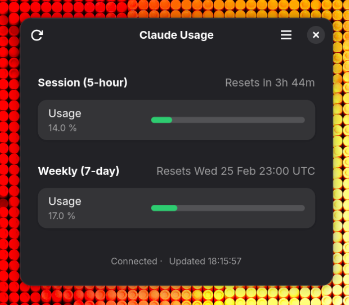

# Claude Usage



A native GNOME desktop application for monitoring Claude Code usage and rate limits. Displays session, weekly, and Opus utilisation with colour-coded progress bars, countdown timers, and desktop notifications.

**Requires a Claude Pro or Max subscription with Claude Code.** This app tracks subscription rate limits, not API key billing. It authenticates via the Claude Code CLI OAuth credentials stored at `~/.claude/.credentials.json`.

> [!NOTE]
> This app relies on [an undocumented Anthropic API endpoint](https://codelynx.dev/posts/claude-code-usage-limits-statusline) used internally by Claude Code.
> It has no official stability guarantees and may break without notice if Anthropic changes or removes the endpoint.

## Features

- **Dashboard** — session (5-hour), weekly (7-day), and Opus usage at a glance
- **Colour-coded bars** — green / amber / red based on utilisation thresholds
- **Auto-refresh** — configurable interval (15–300 seconds, default 60)
- **Desktop notifications** — alerts at 75%, 90%, and 95% session usage
- **Claude Code statusline** — optional bash script for terminal integration
- **Native GNOME** — GTK4 + Libadwaita, GSettings, `Gio.Notification`

## Requirements

- Fedora Workstation (or any distro with GNOME 44+)
- Python 3.12+ with PyGObject (system package)
- GTK4 ≥ 4.10, Libadwaita ≥ 1.4, libsoup3 ≥ 3.0
- Claude Code CLI (for OAuth credentials)

On Fedora, the runtime dependencies are installed by default. For development you also need:

```bash
sudo dnf install python3-gobject gtk4 libadwaita libsoup3
```

## Installation

### Flatpak (recommended)

Install `flatpak-builder` if you don't already have it:

```bash
sudo dnf install flatpak-builder
```

Then build and install the app:

```bash
git clone https://github.com/monooso/claude-usage-gnome.git
cd claude-usage-gnome
flatpak-builder --user --install --force-clean _build io.github.monooso.claude-usage-gnome.yml
```

Launch from the GNOME app grid, or from the terminal:

```bash
flatpak run io.github.monooso.claude-usage-gnome
```

To uninstall:

```bash
flatpak uninstall --user io.github.monooso.claude-usage-gnome
```

### Run from source

If you'd rather skip Flatpak, you can run directly from the source tree. This requires system Python with PyGObject, GTK4, Libadwaita, and libsoup3 (all installed by default on Fedora Workstation):

```bash
git clone https://github.com/monooso/claude-usage-gnome.git
cd claude-usage-gnome
./run.sh
```

The `run.sh` script uses the system Python (`/usr/bin/python3`) with PyGObject. It compiles the GSettings schema automatically on first run.

## Development

### Setup

Create a virtual environment that inherits system site-packages (for PyGObject) and install test dependencies:

```bash
/usr/bin/python3 -m venv --system-site-packages .venv
.venv/bin/pip install pytest
```

### Running tests

```bash
.venv/bin/python3 -m pytest tests/ -v
```

### Project structure

```
src/
├── main.py               # Entry point
├── application.py        # Adw.Application subclass
├── window.py             # Main dashboard window
├── credential_reader.py  # Reads ~/.claude/.credentials.json
├── api_client.py         # Async HTTP via libsoup3
├── usage_model.py        # UsageData dataclass + parser
├── usage_calculator.py   # Threshold/colour logic
├── preferences.py        # Preferences window (GSettings)
└── statusline.py         # Claude Code statusline integration
```

### Contributing

1. Fork the repository
2. Create a feature branch
3. Write tests first (TDD — tests must fail before implementation)
4. Implement the minimum to make tests pass
5. Run the full test suite: `.venv/bin/python3 -m pytest tests/ -v`
6. Submit a pull request

## Acknowledgements

Inspired by [Claude Usage Tracker](https://github.com/ASquaredLLC/claude-usage-tracker), a macOS SwiftUI menu bar app. The terminal statusline colour gradient is adapted from that project's bash script.

## Licence

[GNU Affero General Public License v3.0](LICENSE)
