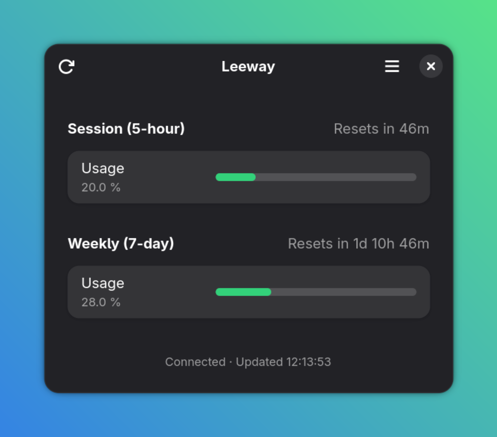

# Leeway



A native GNOME desktop application for monitoring Claude Code usage and rate limits. Displays session, weekly, and Opus utilisation with colour-coded progress bars, countdown timers, and desktop notifications.

**Requires a Claude Pro or Max subscription with Claude Code.** This app tracks subscription rate limits, not API key billing. It authenticates via the Claude Code CLI OAuth credentials stored at `~/.claude/.credentials.json`.

> [!NOTE]
> This app relies on [an undocumented Anthropic API endpoint](https://codelynx.dev/posts/claude-code-usage-limits-statusline) used internally by Claude Code.
> It has no official stability guarantees and may break without notice if Anthropic changes or removes the endpoint.

## Features

- **Dashboard** — session (5-hour), weekly (7-day), and Opus usage at a glance
- **Colour-coded bars** — green / yellow / red based on GNOME HIG palette
- **Auto-refresh** — configurable interval (15–300 seconds, default 60)
- **Desktop notifications** — alerts at 75%, 90%, and 95% session usage
- **Claude Code statusline** — optional bash script for terminal integration
- **Keyboard shortcuts** — Ctrl+R refresh, Ctrl+, preferences, Ctrl+? shortcuts
- **Native GNOME** — GTK4 + Libadwaita 1.8, GSettings, `Gio.Notification`

## Requirements

- GNOME 49+ (org.gnome.Platform 49)
- Python 3.12+ with PyGObject
- GTK4, Libadwaita ≥ 1.8, libsoup3
- Claude Code CLI (for OAuth credentials)

## Installation

### GNOME Builder (recommended for development)

Open the project in [GNOME Builder](https://apps.gnome.org/Builder/) and click the play button. Builder will handle the Flatpak SDK, dependencies, and build automatically.

### Flatpak (command line)

Install `flatpak-builder` if you don't already have it:

```bash
sudo dnf install flatpak-builder
```

Then build and install the app:

```bash
git clone https://github.com/monooso/leeway.git
cd leeway
flatpak-builder --user --install --force-clean _build me.stephenlewis.Leeway.json
```

Launch from the GNOME app grid, or from the terminal:

```bash
flatpak run me.stephenlewis.Leeway
```

To uninstall:

```bash
flatpak uninstall --user me.stephenlewis.Leeway
```

## Development

### Running tests

Tests run outside the Flatpak sandbox using the system Python. Some test files require PyGObject (`gi`) and will be skipped if it's not available.

```bash
python3 -m pytest tests/ -v
```

### Project structure

```
src/
  meson.build              # Build configuration
  leeway.in                # Entry point (configured by Meson)
  app/
    __init__.py
    main.py                # Adw.Application subclass
    window.py              # Main dashboard window
    config.py              # App ID, version constants
    credential_reader.py   # Reads ~/.claude/.credentials.json
    api_client.py          # Async HTTP via libsoup3
    usage_model.py         # UsageData dataclass + parser
    usage_calculator.py    # Threshold/colour logic
    usage_group.py         # Usage group composite widget
    preferences.py         # Preferences dialog (GSettings)
    statusline.py          # Claude Code statusline integration
  ui/
    window.ui              # Main window template
    usage-group.ui         # Usage group template
    preferences.ui         # Preferences dialog template
    shortcuts.ui           # Keyboard shortcuts dialog
    leeway.gresource.xml   # GResource manifest
data/
  me.stephenlewis.Leeway.desktop.in
  me.stephenlewis.Leeway.gschema.xml
  me.stephenlewis.Leeway.metainfo.xml.in
  me.stephenlewis.Leeway.service.in
  icons/
    ...
tests/
  conftest.py              # Shared test configuration
  test_api_client.py
  test_credential_reader.py
  test_statusline.py
  test_usage_calculator.py
  test_usage_model.py
  test_window.py
```

### Contributing

1. Fork the repository
2. Create a feature branch
3. Write tests first (TDD — tests must fail before implementation)
4. Implement the minimum to make tests pass
5. Run the full test suite: `python3 -m pytest tests/ -v`
6. Submit a pull request

## Acknowledgements

Inspired by [Claude Usage Tracker](https://github.com/ASquaredLLC/claude-usage-tracker), a macOS SwiftUI menu bar app. The terminal statusline colour gradient is adapted from that project's bash script.

## Licence

[GNU Affero General Public License v3.0](LICENSE)
